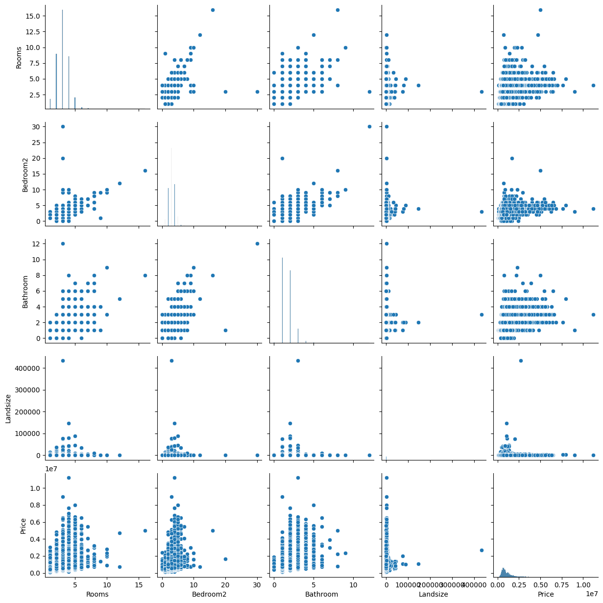
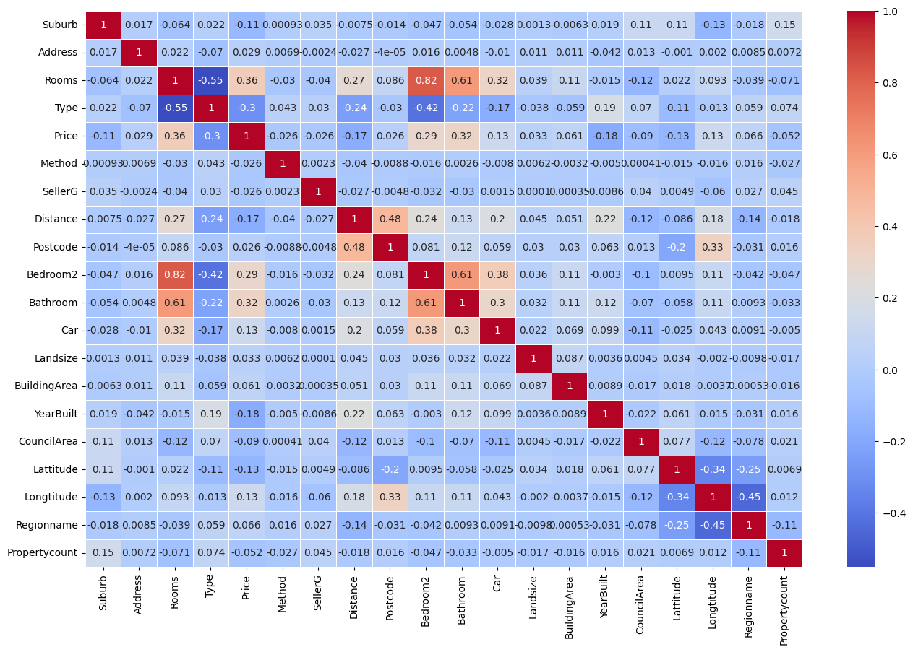
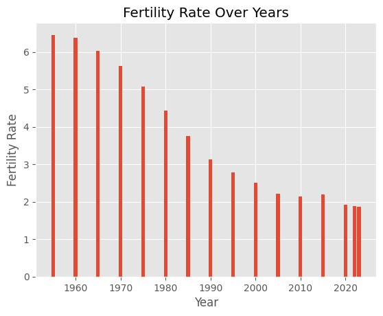
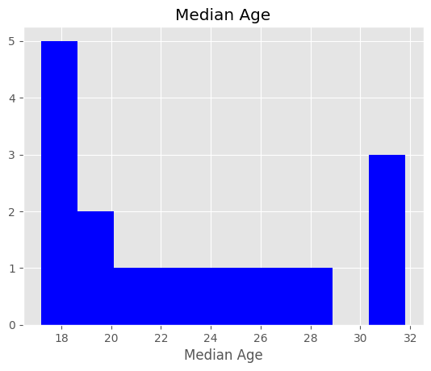
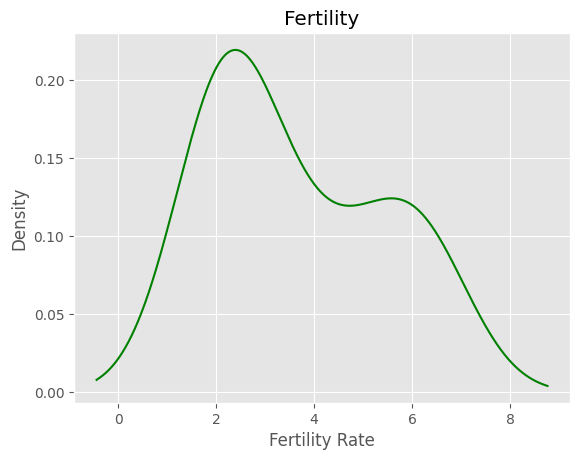
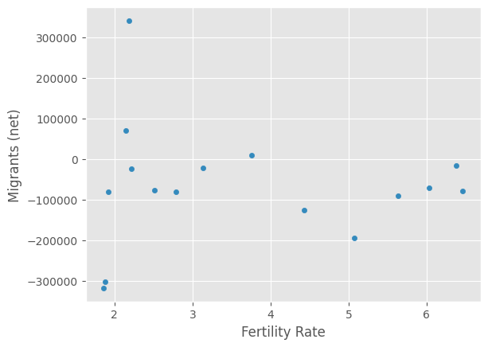
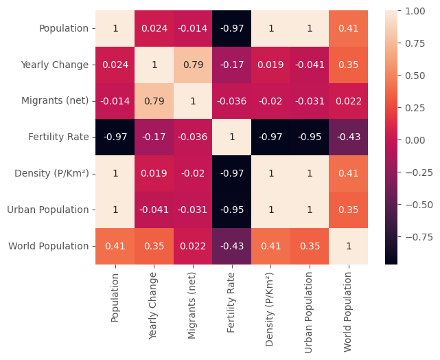

# Berat Hamança Portfolio
Data Science, Data Analysis Portfolio

# [House Sale](https://github.com/Hamancab/House_Sale)
    • Categorical variables defined in the dataset.

    • Duplicate data in the dataset identified and removed.

    • Outlier data detected and removed using the Z-score.

    • Missing values identified and filled with the mode value.

    • A histogram chart created to visualize the distribution of prices.

    • A pair plot  created to visualize the relationship between all numerical variables and the price variable.

    • Label encoding and one-hot encoding applied to categorical variables.

    • Regression models trained, which could have included:
       - Lasso Regression
       - Ridge Regression
       - Elastic Net Regression
       - K-Nearest Neighbors Regression
       - Random Forest Regression
       - Gradient Boosting Regression
       - AdaBoost Regression

    
    ########## Lasso ##########
    MAE: 306973.975
    MSE: 232472906097.5604
    RMSE: 479684.9899
    R2: 0.344
    ########## LinearRegression ##########
    MAE: 306982.5951
    MSE: 232488836350.3438
    RMSE: 479701.3941
    R2: 0.344
    ########## Ridge ##########
    MAE: 306828.6422
    MSE: 232095777084.772
    RMSE: 479311.0778
    R2: 0.345
    ########## ElasticNet ##########
    MAE: 341691.1269
    MSE: 290718587884.6142
    RMSE: 534600.1951
    R2: 0.1721
    ########## KNeighborsRegressor ##########
    MAE: 390671.8191
    MSE: 344962246048.91
    RMSE: 585149.5129
    R2: 0.0212
    ########## RandomForestRegressor ##########
    MAE: 250949.2373
    MSE: 197226575022.6528
    RMSE: 440943.0381
    R2: 0.4469
    ########## GradientBoostingRegressor ##########
    MAE: 270924.8931
    MSE: 204810551887.6018
    RMSE: 449486.0586
    R2: 0.4251
    ########## AdaBoostRegressor ##########
    MAE: 377253.1867
    MSE: 283612852600.8068
    RMSE: 530123.5535
    R2: 0.1964

.png)

       
# [Turkey Population](https://github.com/Hamancab/Turkey_Population)
    • Data types modified.

    • Empty values identified and replaced with appropriate data.

    • Duplicate values  identified and removed from the dataset.

    • Bar charts, histograms, kernel density estimation (KDE) plots, and scatter charts were generated to gain insights into the data.

    •  Data correlation calculated, and a heatmap was generated to visualize the relationships between variables.

